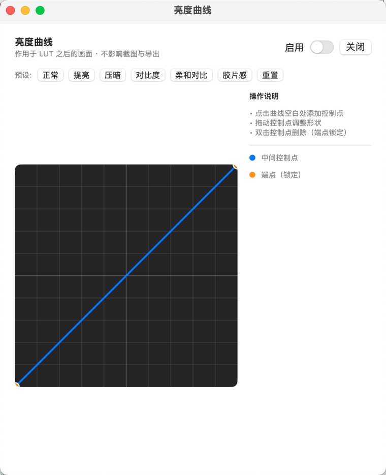

# CutPlayer

**为「看 LOG 灰片 + 套监看 LUT」工作流打造的 macOS 本地视频播放器。**

10bit / 4K 原生播放 · 监看 LUT 自动记忆 · 亮度曲线只影响预览 · 截图与片段导出带 LUT 不带曲线


> 当前版本 **0.1.1** · Apple Silicon (arm64) · macOS 14+ · 详细用法见 [使用手册](docs/使用手册.md)

---

## 它解决什么问题

普通播放器能放视频，但做监看时总会卡在这几件事上：

| 痛点 | CutPlayer 的做法 |
|---|---|
| LOG 灰片要有 LUT 才看得出曝光，但每次打开都要重新套一遍 | **自动记忆**：文件级 + 目录级两套规则，打开就自动套上；支持多选批量设置 |
| 想要"带 LUT 的截图"发给别人看 | 内置截图，16bit PNG，**带 LUT**，一键落地到 `~/Movies/CutPlayer/Screenshots` |
| 想截一小段最高画质的素材做参考 | 内置片段导出，默认 **H.265 10bit 4:2:2 硬件编码 → MP4**（访达空格可预览）|
| 想临时微调亮度，又不想污染截图/导出 | 内置**修图式亮度曲线**，作用于 LUT 之后、**只影响预览**，绝不进截图与导出 |
| 素材"标签撒谎"导致画面发灰或死黑 | 输入色彩范围**三级判定**（手动覆盖 → 标签 → 像素抽查），并按文件记住选择 |
| 拖进度条后"声音先跑、画面追" | 音频等画面：目标帧真正绘制出来的瞬间才释放音频 |

---

## 功能一览

### 播放
- 自研管线：**FFmpeg 解码 → Metal 渲染**（不依赖系统播放器，也不走 mpv 的视频输出）
- 10bit / 4K / 高码率；4K50 10bit 4:2:2 软解实测 ≈ **90fps**
- 播放/暂停、5s / 30s 跳转、进度条、倍速 0.5–2×、音量（0–150%）、静音、全屏
- 播放列表：拖放导入、文件夹递归扫描、多选（⌘ / ⇧）、拖动排序、断点续播
- 音频由 libmpv 负责，画面与声音严格对齐

### 监看 LUT
- 支持 `.cube`；实时生效，作用于解码后的原始 RGB
- **自动记忆**：文件级 + 目录级，重新打开自动套用
- **批量套用**：多选后右键或点左栏 LUT 按钮一次设置
- **LUT 库**：常用 LUT 导入一次，之后一键套用；同名自动去重
- 列表行右侧显示 LUT 徽标，一眼看出哪些文件套了哪个 LUT

### 亮度曲线
- 修图风格编辑器：点击加点、拖动调整、双击删除
- 端点可上下拖动（抬黑场 / 压白场），但不可删除——防误删
- **顺序**：先 LUT，后曲线；**范围**：只影响预览画面
- 面板是**独立浮动窗口**，调曲线时画面完整可见、不被遮挡



### 截图与导出
- 截图：16bit PNG，**带 LUT、不带曲线**（`S` / `⌘S`）
- 导出：按入点/出点截取，**带 LUT、不带曲线**（`E` / `⌘E`），完成后可一键在访达中显示
- 导出预设：H.265 10bit 4:2:2 硬件（默认）/ H.265 4:2:0 硬件 / x265 慢速 / H.264 8bit / FFV1 无损

### 界面
- 整片白色自绘 chrome：无系统工具栏、无分割线
- 顶栏/底栏鼠标离开 2 秒自动隐藏
- **点击视频标题收起/展开播放列表**（全屏与非全屏都可用），侧栏收起时标题自动避开红绿灯
- 侧栏宽度可拖动，**重启后记住**；窗口变窄时平滑收敛

---

## 系统要求

| 项目 | 要求 |
|---|---|
| 机型 | **Apple Silicon（arm64）**，不支持 Intel Mac |
| 系统 | macOS 14.0+ |
| 磁盘 | 约 250 MB（含内置 FFmpeg 与 libmpv 依赖）|

---

## 安装（普通用户）

1. 下载 `CutPlayer-x.y.z-arm64.dmg`，双击打开，把 **CutPlayer** 拖进「应用程序」
2. **首次打开**：本项目为本地构建、仅做临时签名，macOS 可能提示"无法验证开发者"，二选一：
   - 在「应用程序」里**右键点 CutPlayer → 打开 → 再点「打开」**
   - 或终端执行一次：`xattr -dr com.apple.quarantine /Applications/CutPlayer.app`

每个按钮的作用、快捷键、常见问题，见 **[docs/使用手册.md](docs/使用手册.md)**。

---

## 从源码构建

```bash
# 依赖（仅构建机需要，均 arm64）
brew install ffmpeg mpv

# 编译 + 打包成 .app（自动捆绑 ffmpeg/libmpv 及其全部传递依赖并重签）
./scripts/build_app.sh arm64 release
open build/CutPlayer.app
```

> 受限沙箱环境里 SwiftPM 自身的沙箱可能报 `sandbox_apply: Operation not permitted`，
> 此时用 `CUTPLAYER_NO_SWIFT_SANDBOX=1 ./scripts/build_app.sh arm64 release` 关闭内层沙箱。

### 单元测试

CLT 环境没有 XCTest，项目使用自研轻量 harness（headless）：

```bash
arch -arm64 swift run --arch arm64 CutPlayerTests
```

### 端到端自检

```bash
./scripts/make_test_assets.sh          # 生成合成测试素材（4K 10bit 视频 + 测试 LUT）

build/CutPlayer.app/Contents/MacOS/CutPlayer \
  --selftest \
  --input "TestAssets/sample_4k10bit.mkv" \
  --lut   "TestAssets/test_lift.cube" \
  --outdir /tmp/cutplayer_selftest
```

自检会真实解码 → 套 LUT → 启用曲线 → 截图 → 导出，再用 ffmpeg 渲染参考帧做 PSNR 判定，
输出 JSON（`pass` 全为 true 才通过）。判定项与实测数值见
[架构说明](docs/ARCHITECTURE.md)。

其它无头模式：`--decbench`（解码性能）、`--seektest` / `--seekprobe`（跳转延迟）、
`--enginetest`（引擎一致性）、`--modelseek`（模型层跳转）。

---

## 项目结构

```
CutPlayer/
├── Sources/
│   ├── CutPlayer/            可执行入口（正常模式 / 无头测试分支）
│   ├── CutPlayerKit/         全部业务代码
│   │   ├── App/              SwiftUI App、菜单命令、全局按键、自检驱动
│   │   ├── Playback/         libmpv 音频客户端、FFmpeg 解码、帧队列、Metal 渲染
│   │   ├── Filters/          导出用滤镜参数转义
│   │   ├── Data/             SQLite（LUT 记忆 / 进度 / 输入范围 / LUT 库）
│   │   ├── Services/         片段导出编排与参数构造
│   │   └── UI/               窗口 chrome、播放列表、顶/底栏、曲线编辑器、导出面板
│   ├── CMPV/                 C shim：mpv client API
│   └── CFFmpeg/              C shim：FFmpeg 解码 API
├── Tests/CutPlayerTests/     自研测试 harness
├── scripts/                  构建、打包、测试素材生成、图标生成
├── Resources/                Info.plist、AppIcon.icns
├── docs/                     使用手册 / 架构说明 / 图片
└── TestAssets/               测试素材（已 gitignore，用脚本生成）
```

---

## 架构速览

```
视频文件 ─► FFmpeg 解码 ─► 帧队列(滑窗6) ─► Metal 渲染 ─► 3D LUT ─► 亮度曲线 ─► 屏幕
                                              └─► 离屏再渲染（跳过曲线）─► 16bit PNG 截图
音频/时钟 ─► libmpv (vo=null)          导出 ─► 内置 ffmpeg `-vf lut3d`（不含曲线）
记忆 ─► SQLite（文件/目录 LUT、进度、输入范围、LUT 库）
```

几个关键取舍（细节见 **[docs/ARCHITECTURE.md](docs/ARCHITECTURE.md)**）：

- **mpv 只做音频与时钟**：mpv 的视频输出无法满足"曲线只进预览"这条链路，也不好控制 4:2:2 10bit 的性能与色彩处理
- **LUT 打包成 2D strip 纹理**在片元着色器里三线性采样；曲线是 LUT **之后**的 1D 纹理查找
- **声画同步**：seek/换片时按住音频，目标帧绘制完成才释放；落后目标时间的帧直接丢弃，绝不 hold-and-stall
- **输入色彩范围三级判定**：手动覆盖 → 标签 → 像素抽查（相机素材"标签撒谎"很常见）
- **窗口 chrome 自绘**：系统分割线无法覆盖，改用 `NSSplitView` + 帘幕式裁剪动画

---

## 调试用环境变量

正常使用不需要，开发/自动化时有用：

| 变量 | 作用 |
|---|---|
| `CUTPLAYER_OPEN_FILE=a:b` | 启动即把冒号分隔的文件加入播放列表并打开第一个 |
| `CUTPLAYER_HIDE_SIDEBAR=1` | 以"侧栏已收起"状态启动 |
| `CUTPLAYER_OPEN_CURVE=1` | 启动即打开亮度曲线面板 |
| `CUTPLAYER_SCREENSHOTS_DIR` | 覆盖截图输出目录 |
| `CUTPLAYER_DECODER_DEBUG=1` | 打印解码器 seek 细节 |
| `CUTPLAYER_NO_SWIFT_SANDBOX=1` | 构建时关闭 SwiftPM 内层沙箱 |

---

## Roadmap

- [ ] **Windows 版**（FFmpeg / libmpv / SQLite 可直接复用，需重写渲染层与 UI，路线见架构文档）
- [ ] HDR / 杜比视界素材的色调映射（目前按 SDR 处理）
- [ ] 音轨 / 字幕轨切换
- [ ] RGB 分通道曲线
- [ ] 播放列表持久化、首帧缩略图
- [ ] 4:2:0 色度上采样算法对齐 ffmpeg（当前彩色边缘极细微处可能有差异）

---

## 已知限制

- **仅 macOS / Apple Silicon**；Intel Mac 与 Windows 尚未支持
- HDR 素材未做色调映射，颜色不正确
- 4:2:2 / 4:2:0 10bit 大分辨率素材依赖**软件解码**，导出时建议暂停播放
- 应用为本地构建版，未做 Apple 开发者签名与公证（首次打开需右键打开）

---

## 第三方组件与许可

本项目**自身源码**的许可证见下一节；但**打包出的 App / DMG 内捆绑了第三方二进制**：

| 组件 | 用途 | 许可证 |
|---|---|---|
| [FFmpeg](https://ffmpeg.org/legal.html) | 视频解码、片段导出 | LGPL-2.1+；**启用 GPL 组件（x264/x265 等）后为 GPL-2.0+**，Homebrew 构建即属此类 |
| [mpv / libmpv](https://github.com/mpv-player/mpv) | 音频解码与时钟 | LGPL-2.1+；**Homebrew 构建含 GPL 组件，整体按 GPL-2.0+ 分发** |
| [SQLite](https://sqlite.org/copyright.html) | 记忆库 | Public Domain |

**分发打包好的 App（而不是仅分发源码）时需要遵守上述许可证**：提供对应源码或获取途径、
保留许可证与版权声明；GPL 组件还要求整个分发物以 GPL 兼容方式授权。
若想避免这些义务，可以只分发源码 + 让用户自行 `brew install ffmpeg mpv`，或改用 LGPL 构建的依赖。

---

## 许可证

**GPL-3.0-or-later** · Copyright (C) 2025 CutPlayer contributors · 全文见 [LICENSE](LICENSE)

为什么选它：

- 本项目默认打包会把 **GPL 版 mpv / FFmpeg** 嵌进 App（见上一节），分发这样的二进制时，
  整个分发物必须是 GPL 兼容的 —— GPL-3.0 与之完全兼容，**不存在侵权风险**；
- GPL **不禁止**别人商用，但**任何分发出去的衍生版本都必须以 GPL 开源**（包括其修改），
  因此不适合被直接拿去做闭源商业产品；
- 想彻底禁止商用，只能用"源码可见但非开源"的许可证（如 PolyForm Noncommercial），
  代价是**必须停止分发捆绑 GPL 依赖的 DMG**、只分发源码。

**双授权（可选）**：如果你是全部代码的版权所有者（当前仓库满足），可以在此声明
"如需闭源商业授权请联系 xxx"，从而在保持开源的同时提供付费商用路径。

---

## 贡献

欢迎 issue 与 PR。改动前建议：

1. 跑一遍 `swift run --arch arm64 CutPlayerTests` 与 `--selftest`，确认基线是绿的；
2. 涉及画面/色彩的改动，请附上自检 PSNR 数值变化；
3. 涉及 UI 的改动，请说明在**全屏**与**非全屏**两种状态下的表现。

---

*CutPlayer · GPL-3.0-or-later · [使用手册](docs/使用手册.md) · [架构说明](docs/ARCHITECTURE.md)*
